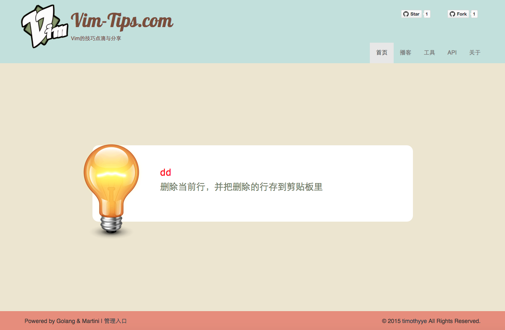
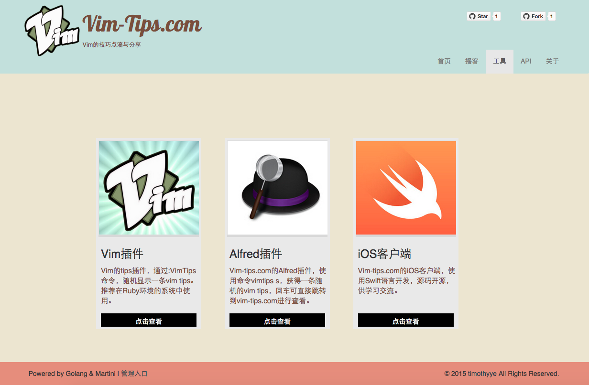
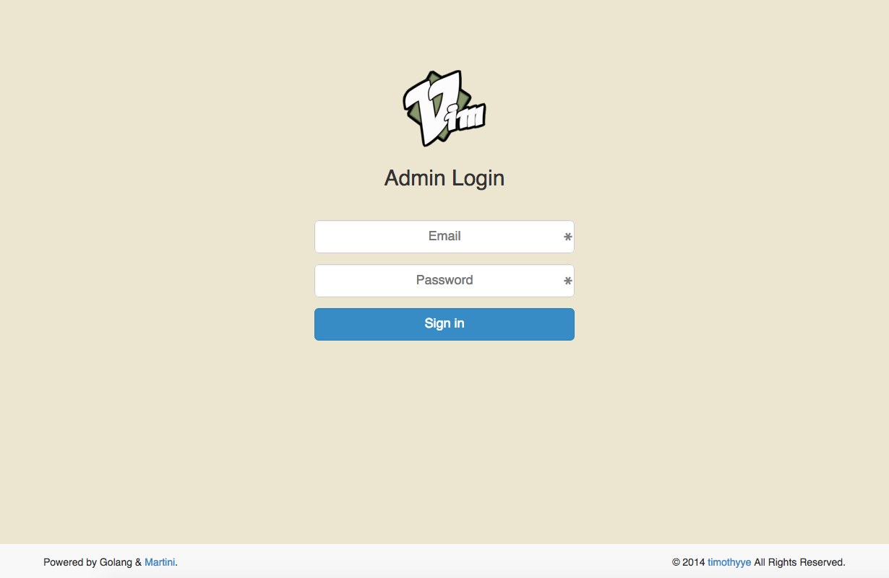
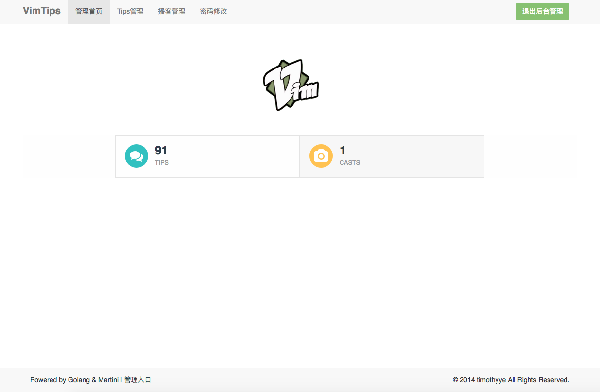
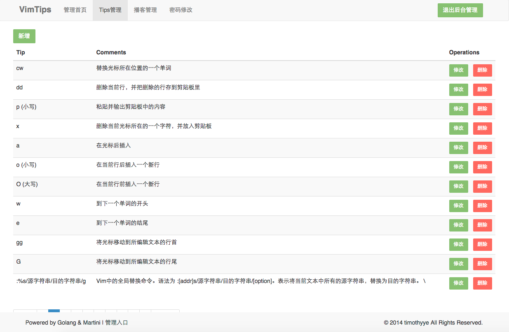

vim-tips-web
============

[](https://drone.io/github.com/TimothyYe/vim-tips-web/latest)

[Vim-Tips.com](https://vim-tips.com) is a site to share tips for Vim. 

The first version of [Vim-Tips.com](https://vim-tips.com) is written by Rails.

Now I re-designed this whole site and implemented it by Go.

## Prerequisite

* Go environment is needed. 
* MongoDB is installed.

## Download the sample database

Download sample DB from: [https://github.com/TimothyYe/vim-tips-web/tree/master/db](https://github.com/TimothyYe/vim-tips-web/tree/master/db)

## Restore it to MongoDB

* Unzip the database, the DB directory is: vim_tips
* Restore it to MongoDB

```bash
mongorestore -h localhost -u user -p pass -d vim_tips ./vim_tips
```

Note that username and password is the id and password for your MongoDB, for the default, -u & -p is not needed.

## Build it

* Get source code from Github:

```bash
git clone https://github.com/TimothyYe/vim-tips-web.git
```
* Go into the source code directory, get related library and then build it:

```bash
cd vim-tips-web
go get
go build
```

## Run it

* Run vim-tips-web site:
```bash
nohup ./vim-tips-web &
```

* Now, type [http://localhost:3000](http://localhost:3000) in web browser to visit the site.

## Screenshots











## Default username and password for admin panel

Use default username & password to logon admin panel:

* Username is:admin@vim-tips.com
* Password is:111
